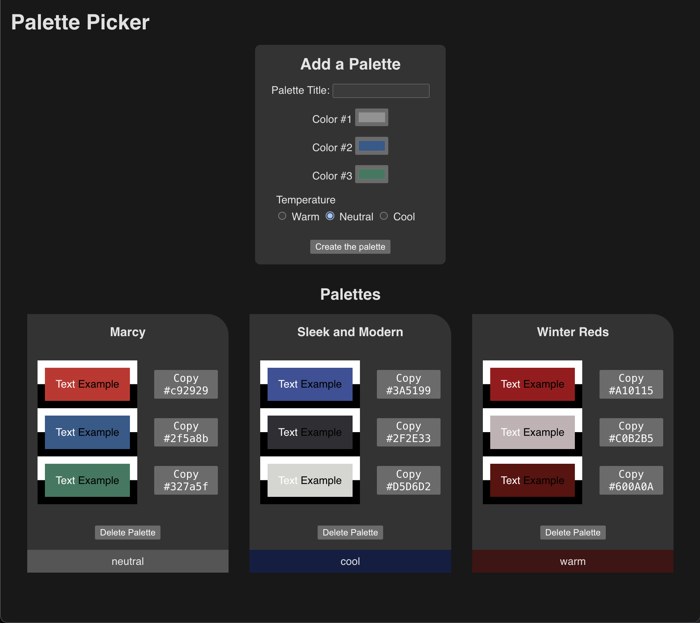
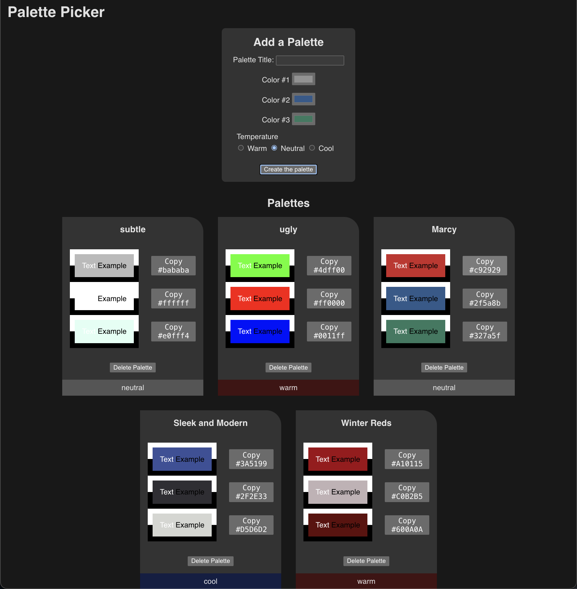
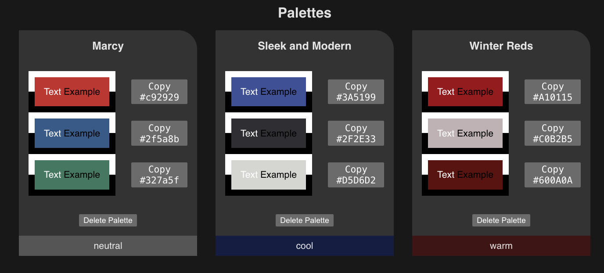
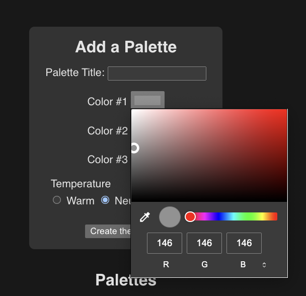

# 2.3.0 - Solo Project: Palette Picker

- [2.3.0 - Solo Project: Palette Picker](#230---solo-project-palette-picker)
- [Project Description](#project-description)
- [User Stories](#user-stories)
- [Vite and getting started](#vite-and-getting-started)
  - [esModules](#esmodules)
- [Tech Tips](#tech-tips)
  - [UUIDs](#uuids)
  - [Data attributes](#data-attributes)
  - [Color inputs](#color-inputs)
  - [Required fields](#required-fields)
  - [palettes.json](#palettesjson)
  - [Saving to localStorage](#saving-to-localstorage)
  - [Copying to the clipboard](#copying-to-the-clipboard)
- [Tech Rubric](#tech-rubric)
  - [Layout: Structure](#layout-structure)
  - [layout: Accessibility](#layout-accessibility)
  - [Functionality](#functionality)
  - [Meta](#meta)

# Project Description
We're going to be building a palette picker program today. A "color palette" is a set of colors that go well together. We're going to be building a program that allows users to create their own palettes, and save them for later. We'll also be able to delete palettes, and copy the colors to the clipboard.

In real life, design palettes can be *huge* with dozens of colors to handle all sorts of things. Today, we're keeping it simple and only using 3 colors per palette.



And here it is with more colors. You should use `flexbox` or `grid` to handle the layout of the palettes.


# User Stories
As always, let's start our journey with the user, what can they actually do with our site? There are technical requirements below, but these are the user stories that we're trying to solve. Two different ways of looking at a project, both useful!

A user:
- Can create a palette by using a form
- Will give their palette a title, three colors, and a temperature
- Can't submit a form without giving it a title
- Can visually choose their colors using a color picker
- Is greeted by 3 default palettes the first time they visit the site (or if they delete all their palettes)
- Can see all the palettes they create in the `palettes` section of the page
- Can see their colors with a black and white text example overlaid on each color
- Can see their colors with a black and white border around each one
- Can see the temperature of each palette in a banner along the bottom of each one
- Can click a button next to any color to copy the hex code to their clipboard (`#ffffff` for example)
- Can click the copy button and see the text change to "Copied hex!" for 1 second before switching back
- Can delete a palette they don't like by clicking the delete button
- Has their palettes saved so even if they close the site, upon returning they can see their palettes

Here are some close ups and examples of what we're looking for:


Here's the color picker:


# Vite and getting started
Remember, we're using Vite for this project! To get started do:

```bash
npm create vite
# This will pop up a CLI walkthrough, pick
# Project name: palette-picker
# Select "Vanilla" for the framework
# Select JavaScript for the variant
cd palette-picker
git init
npm install
```

Now that's going to create some boilerplate code you don't need:
- delete `counter.js`
- delete `javascipt.svg`
- Keep but empty out `style.css` and `main.js`
- Rename the `title` tag in `index.html` but don't touch anything else

We'll change some thing later in order to deploy to GitHub pages, but that's all you need to start!

## esModules
Remember, Vite doesn't use commonjs modules like node.

Here's a [crash course on esmodules](https://www.youtube.com/watch?v=cRHQNNcYf6s) if you need it.

Honestly though, to start it's a real simple notation change:

```js
// commonjs default import
const library = require('library-name');
const localModule = require('./local-module');

// esmodules default import
import library from 'library-name';
import localModule from './local-module';


// commonjs named import
const { namedThing } = require('library-name');
const { namedLocal } = require('./local-module');

// esmodules named import
import { namedThing } from 'library-name';
import { namedLocal } from './local-module';

// esmodules named import with alias
const { namedThing as alias } = require('library-name');

// common js default export
module.exports = namedThing;

// esmodules default export
export default namedThing;

// commonjs named export
module.exports = { namedThing };

// esmodules named export:
// - each one
export const thing = () => {}
export const otherThing = () => {}
// or all together
export {
  thing2,
  otherThing2
}
```
There are a few more bells and whistles but that's honestly all you need.

Also, what's super cool with Vite is that you can load in some style files in your JS instead of with your html. So don't panic when you see

```js
import './styles.css';
```

# Tech Tips
This is a big project, so here are some helpful things for you to consider. Also, keep in mind you can look at the rubric at the end as a sort of guide to what you need to do.

## UUIDs
Up until now, to get ahold of an item in an array, we've relied exclusively on it's index, but that won't always work. Say you have some items in your data store, then you filter to only show a few. How would you know which is which? The filtered index won't match the *true* index anymore.

That's were the concept of "ids" comes along. We've seen them in HTML as a way of uniquely identifying an element. A common way to assign data ids on the frontend is by using the [uuid package](https://www.npmjs.com/package/uuid):

```bash
npm i uuid
```
Then, whenever you need a "universally unique identifier" you can do:

```js
import { v4 as uuidv4 } from 'uuid';

console.log(uuidv4());
```

Now, technically in this project we don't do any filtering so we don't *need* uuids, but it's a good habit to get into. And we encourage you to use them in this project anyway. The default palettes come with them to keep the options open.

## Data attributes
Some things in this project get *way* easier if you know what a data attribute is and why you'd likely want them on buttons. If you are unfamiliar with data attributes in html and `dataset` in JS, make sure you read up on them (your DOM assignment used them!).

## Color inputs
You know how there's a ton of input types? Check out `color` for this project!

## Required fields
Do you know how to make an HTML form treat an input as `required`? It's not hard, try figuring it out, and make sure the text input is required!

## palettes.json
We're giving you 3 palettes to start! In the real world, you'd probably query a server or something, but we're just going to give them to you as a `json` file (copy it out of this repo and into your project).

```json
[
  {
    "uuid": "5affd4e4-418d-4b62-beeb-1c0f7aaff753",
    "title": "Marcy",
    "colors": [ "#c92929", "#2f5a8b", "#327a5f" ],
    "temperature": "neutral"
  },
  {
    "uuid": "32521ef4-d64c-4906-b06d-f3d0d6b16e0f",
    "title": "Sleek and Modern",
    "colors": [ "#3A5199", "#2F2E33", "#D5D6D2" ],
    "temperature": "cool"
  },
  {
    "uuid": "8b144d62-faa7-4226-87e1-096d7c1bedc7",
    "title": "Winter Reds",
    "colors": [ "#A10115", "#C0B2B5","#600A0A" ],
    "temperature": "warm"
  }
]
```

And what's super cool about JSON is that you can read the file type from the browser. How? We don't have the Node `fs` module, no we can just import it directly, like this:

```js
// data-store.js

import palettes from './palettes.json'
console.log(palettes); // It's now regular JS code!
```
Pretty cool right? The only catch is you *must* specify the file type `.json`. Use these as your default palettes, and what appears if a user deletes all existing palettes.

## Saving to localStorage
> We do not want to use `sessionStorage` that's different!

We want our palettes to persist across sessions. We don't need databases to do this, assuming we're ok with only saving the data to the user's browser. Here's an [article explaining localStorage](https://www.freecodecamp.org/news/how-to-store-data-in-web-browser-storage-localstorage-and-session-storage-explained/)

Once you understand the basics of `localStorage`, you can make some helper functions like:
- `setLocalStorageKey(key, value)`
  - This is a wrapper that automatically stringifies the value and sets it to the key
- `getLocalStorageKey(key)`
  - This is a wrapper that automatically parses the value and returns it, but also handles the errors (`JSON.parse` should always be wrapped in a `try/catch` since it breaks so easily). If there's an error it `console.errors` it and returns `null`

With those two out of the way, you can make some more focused helper functions like:
- getPalettes()
  - Always return an array, either full of palettes or empty, this will make your downstream iterator functions a *lot* cleaner
- setPalettes(newPalettes)
  - Replace whatever palettes are saved in `localStorage` with
- initPalettesIfEmpty()
  - This one is important! If you don't have any palettes on page load, then you should add the default palettes to localStorage. *To be clear, that's on page load, not the second they have 0 palettes*. So if the user deletes each palette and then refreshes the page, suddenly the defaults will appear.
- addPalette(newPalette)
  - Add the palette to your saved localStorage palettes.
- removePalette(paletteUuid)
  - Remove the palette from your saved localStorage palettes as found by the palette's `uuid`

Remember these functions are all *only* the data layer of our project. None of them should be touching the DOM, that's the job of other rendering functions. For example, `removePalette()` should only remove the palette from the localStorage array, do not try to remove it from the DOM in this function.

## Copying to the clipboard
This used to be a pain, but now it's not! Check out this [article explaining how to copy with the clipboard API](https://chiamakaikeanyi.dev/how-to-copy-text-with-ease-in-javascript-using-the-clipboard-api/). This is a crucial feature, don't forget it!

And don't forget that users need some confirmation of a copy, so alter the buttons text for a second to say "Copied hex!" for 1 second before switching back. Remember `setTimeout`?

# Tech Rubric
In order to see how well you're doing with this project, here are all the things we need would like to see from you. If you get all of these, then you know that you're where you need to be!

## Layout: Structure
- [ ] There is a single `main` element on the page
- [ ] There is a single `h1` element on the page
- [ ] There is a `form`
- [ ] The form has an `h2` label
- [ ] The form has an `text` input and label for the palette title
- [ ] The form has 3 `color` type inputs and labels for the color inputs
- [ ] The form has a `fieldset` with a `legend` for the temperature setting
- [ ] The form has 3 `radio` inputs and `labels` for the temperature setting
- [ ] The form has `neutral` as the default temperature setting
- [ ] The form has a `button` to submit the form
- [ ] There is an `h2` showing the palettes section
- [ ] There is a `section` for the palettes
- [ ] The page has a `ul` and `li` items that show each palette
- [ ] Each palette has the 3 colors clearly visible somehow
- [ ] Each palette has white and black text overlaid on each of the colors
- [ ] Each palette *somehow* has white and black border on each of the colors
- [ ] Each palette has 3 copy buttons that show the name of the color they *would* copy
- [ ] Each palette has a delete button
- [ ] Each palette has a banner along the bottom with the name of the temperature
- [ ] Each palette has a banner along the bottom that is colored by the temperature
  - (gray = neutral, red = warm, blue = cool)
- [ ] Palettes appear next to each other in a grid-like pattern (flex or grid presentations fine)

## layout: Accessibility
- [ ] The form has an `aria-label` or `aria-labelledby` attribute that describes the form
- [ ] The section has an `aria-label` or `aria-labelledby` attribute that describes the section
- [ ] There are no instances of recreating any semantic elements

## Functionality
- [ ] The title is a `required` field, and the form cannot be submitted without it
- [ ] Clicking the form submit button does not reload the page because the default behavior is prevented
- [ ] Clicking the form submit button creates a new palette in the palettes section
- [ ] Clicking the form submit button clears the form
- [ ] Clicking one of the copy buttons copies the hex code of the color to the clipboard
- [ ] Clicking the copy button copies the selected color to the user's clipboard
- [ ] Clicking the copy button alters the text for a second to say "Copied hex!" for 1 second before switching back
- [ ] Clicking the delete button removes the palette from the page
- [ ] Clicking the delete button removes the palette from localStorage (does not come back upon reload of page)
- [ ] On first visit to the page, there are 3 default palettes
- [ ] If a user deletes all their palettes, on next reload, the default palettes appear again
- [ ] A user's palettes are saved to localStorage

## Meta
- [ ] The project is created using Vite
- [ ] The code exists in more than one JS file
- [ ] The project is deployed via GitHub Pages properly
- [ ] The `palettes.json` file is read properly
- [ ] css flexbox or grid was used
- [ ] The code does not render unescaped text directly to the DOM (createElement or other escape method used)
- [ ] `.innerHTML` or `createElement/.append` is used properly at some point in the project
- [ ] `.innerHTML` or `.remove()` is used to delete elements from the DOM.
- [ ] The `setTimeout` method is used to rewrite the copy button text